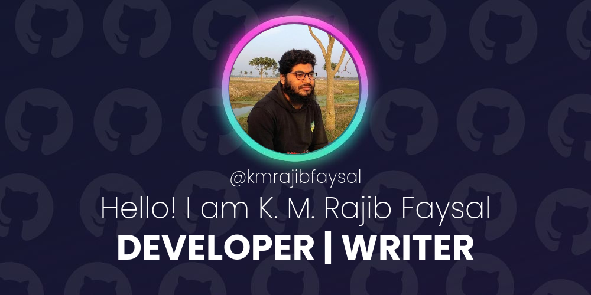

<!-- <h1> Hey! Nice to see you.</h1> -->

- 🔭 I'm currently working on [Front end Web Development][course]
- 🌱 I’m currently learning React. 
- 👯 I’m looking to collaborate with other content creators
- 🥅 2022 Goals: Contribute more to Open Source projects
- ⚡ Fun fact: I love travelling! ✈️

### :dizzy: Connect on Networks

### :zap: Recent GitHub Activity

<!--START_SECTION:activity-->

### GitHub Stats 

  
  
  

  

